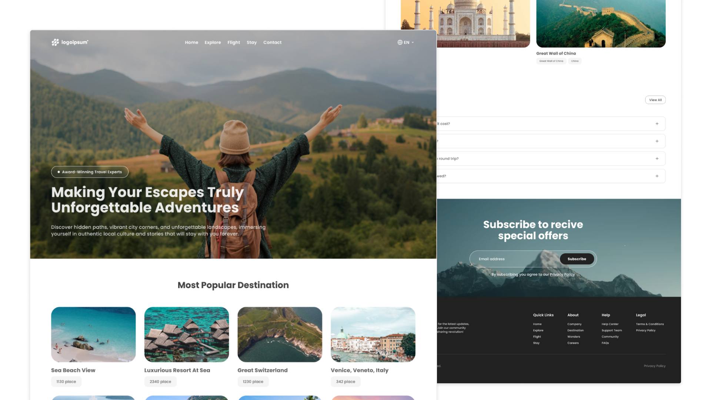

# Travel Landing Page



**Travel Landing Page** is a modern, visually appealing website designed to showcase popular travel destinations, promote special offers, and provide users with a seamless, interactive browsing experience. Built with **React** and **Tailwind CSS**, this project is perfect for travel agencies, tour operators, or any travel-related business aiming to attract and engage visitors.

---

## 🚀 Live Preview & Design

- **[Live Preview](http://travel-page-404.vercel.app/)**
  <br>Experience the Travel Landing Page in action.

- **[Figma Design File](https://figma.com/community/file/1451181783113282606/travel-landing-page)**
  <br>View or duplicate the original Figma design.

---

## ✨ Features

- **Hero Section**: Eye-catching background image, bold headline, and engaging description.
- **Popular Destinations**: Grid of destination cards with images, titles, and place counts.
- **Video Section**: Background image with a play icon, perfect for embedding a promotional or intro video.
- **Explore Section**: Curated travel experience cards showing images, titles, and prices per night.
- **Wonders of the World**: Highlights famous wonders with images and short descriptions.
- **FAQs**: Interactive accordion for frequently asked questions.

---

## 🛠️ Technologies Used

- **React**
- **Tailwind CSS**
- **JavaScript**
- **CSS**
- **HTML**
- **Lenis**

---

## 📁 Project Structure

```
src/
│
├── components/
│   ├── Header.jsx
│   ├── Popular.jsx
│   ├── Explore.jsx
│   ├── Wonders.jsx
│   ├── FAQs.jsx
│   ├── Subscribe.jsx
│   ├── Footer.jsx
│   └── Video.jsx
│
├── App.jsx
├── App.css
└── main.jsx
```

- **components/**: All React components for each section.
- **App.jsx**: Composes all sections for the main app.
- **App.css**: Custom styles and Tailwind layers.
- **main.jsx**: Entry point for rendering the React app.

---

## 💡 Use Cases

Perfect for:

- Travel agencies and tour operators
- Tourism startups
- Destination marketing
- Showcasing travel offers and experiences

---

## ⚡ Installation & Usage

To run this project locally:

1. **Clone the repository:**

   ```bash
   git clone https://github.com/saad-shaikh-256/Travel-Landing-Page.git
   ```

2. **Navigate to the project folder:**

   ```bash
   cd Travel-Landing-Page
   ```

3. **Install dependencies:**

   ```bash
   npm install
   ```

4. **Start the development server:**

   ```bash
   npm run dev
   ```

5. **Open your browser and visit** [http://localhost:5173](http://localhost:5173) _(or the port shown in your terminal)_.

---

## 📝 Notes

- This project is **frontend-only** and does not include backend or booking functionality.
- You can extend the site by adding booking forms, user authentication, or backend integration.
- For custom branding or content, simply update the component files.

---

## 📈 Future Enhancements

- Integration with booking APIs or backend
- Multi-language support
- User authentication & profile management
- Blog or travel stories section
- Dark mode toggle

---

## 🙌 Credits

- **UI Design Inspiration: [Figma Community File](https://figma.com/community/file/1451181783113282606/travel-landing-page)**
- **Developed by [Saad Shaikh](https://saad-shaikh.vercel.app/)**

---

Feel free to suggest features, report bugs, or fork the project!
